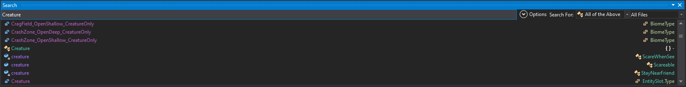

# No Leviathans (or Any Other Creature)

If you want to remove all [Leviathan-class organisms](https://subnautica.fandom.com/wiki/Leviathan_Class_Organisms) from your Subnautica game, this guide is for you.
<br>
<br>
<hr>

### **The installation process down here is only for the older versions and if you want to customize the game.**

To use the newer version either download it from the releases tab or [here](https://www.nexusmods.com/subnautica/mods/1722?tab=files).
<br>
<hr>

## Installation

It's simple to install. Just follow these steps:

1. Open your `subnautica` folder.
2. Navigate to `Subnautica_Data`, then go to `Managed`.
3. Replace the existing DLL with the one you downloaded.
4. Restart Subnautica and enjoy!

## Custom Creatures

If you want custom creatures removed, do this.

1. Download the original file (or use the one in your Subnautica folder) and download [dnSpy](https://dnspy.co/download/).

2. Open dnSpy. Press `CTRL + O` and select the `Assembly-CSharp.dll` from your Subnautica folder.

3. In the search bar, enter `Creature` (see picture below). Make sure you select the first `Creature` you find. Be sure it has a capital `C`.

   

4. Double-click on that entry. Look for the method labeled `public virtual void Start()`, which is on line 72. Right-click that text and select `Edit Method (C#)...`.

5. Replace the method with the following code:

   ```csharp
   using System;
   using System.Collections.Generic;
   using System.Runtime.CompilerServices;
   using ProtoBuf;
   using UnityEngine;
   using UWE;

   // Token: 0x02000176 RID: 374
   [RequireComponent(typeof(Rigidbody))]
   [ProtoContract]
   [ProtoInclude(1000, typeof(BloomCreature))]
   [ProtoInclude(1200, typeof(Boomerang))]
   [ProtoInclude(1300, typeof(LavaLarva))]
   [ProtoInclude(1400, typeof(OculusFish))]
   [ProtoInclude(1500, typeof(Eyeye))]
   [ProtoInclude(1600, typeof(Garryfish))]
   [ProtoInclude(1700, typeof(GasoPod))]
   [ProtoInclude(1800, typeof(Grabcrab))]
   [ProtoInclude(1900, typeof(Grower))]
   [ProtoInclude(2000, typeof(Holefish))]
   [ProtoInclude(2100, typeof(Hoverfish))]
   [ProtoInclude(2200, typeof(Jellyray))]
   [ProtoInclude(2300, typeof(Jumper))]
   [ProtoInclude(2400, typeof(Peeper))]
   [ProtoInclude(2500, typeof(RabbitRay))]
   [ProtoInclude(2600, typeof(Reefback))]
   [ProtoInclude(2700, typeof(Reginald))]
   [ProtoInclude(2800, typeof(SandShark))]
   [ProtoInclude(2900, typeof(Spadefish))]
   [ProtoInclude(3000, typeof(Stalker))]
   [ProtoInclude(3100, typeof(Bladderfish))]
   [ProtoInclude(3200, typeof(Hoopfish))]
   [ProtoInclude(3300, typeof(Mesmer))]
   [ProtoInclude(3400, typeof(Bleeder))]
   [ProtoInclude(3500, typeof(Slime))]
   [ProtoInclude(3600, typeof(Crash))]
   [ProtoInclude(3700, typeof(BoneShark))]
   [ProtoInclude(3800, typeof(CuteFish))]
   [ProtoInclude(3900, typeof(Leviathan))]
   [ProtoInclude(4000, typeof(ReaperLeviathan))]
   [ProtoInclude(4100, typeof(CaveCrawler))]
   [ProtoInclude(4200, typeof(BirdBehaviour))]
   [ProtoInclude(4400, typeof(Biter))]
   [ProtoInclude(4500, typeof(Shocker))]
   [ProtoInclude(4600, typeof(CrabSnake))]
   [ProtoInclude(4700, typeof(SpineEel))]
   [ProtoInclude(4800, typeof(SeaTreader))]
   [ProtoInclude(4900, typeof(CrabSquid))]
   [ProtoInclude(4910, typeof(Warper))]
   [ProtoInclude(4920, typeof(LavaLizard))]
   [ProtoInclude(5000, typeof(SeaDragon))]
   [ProtoInclude(5100, typeof(GhostRay))]
   [ProtoInclude(5200, typeof(SeaEmperorBaby))]
   [ProtoInclude(5300, typeof(GhostLeviathan))]
   [ProtoInclude(5400, typeof(SeaEmperorJuvenile))]
   [ProtoInclude(5500, typeof(GhostLeviatanVoid))]
   [RequireComponent(typeof(CreatureUtils))]
   [DisallowMultipleComponent]
   public partial class Creature : Living, IProtoEventListener, IScheduledUpdateBehaviour, IManagedBehaviour, ICompileTimeCheckable, IMovementPlatform
   {
       // Token: 0x060009E1 RID: 2529 RVA: 0x0006E274 File Offset: 0x0006C474
       public virtual void Start()
       {
           string name = base.GetType().Name;
           if (__________)
           {
               base.gameObject.SetActive(false);
               return;
           }
           if (this.initialCuriosity != null && this.initialCuriosity.length > 0)
           {
               this.Curiosity.Value = this.initialCuriosity.Evaluate(UnityEngine.Random.value);
           }
           if (this.initialFriendliness != null && this.initialFriendliness.length > 0)
           {
               this.Friendliness.Value = this.initialFriendliness.Evaluate(UnityEngine.Random.value);
           }
           if (this.initialHunger != null && this.initialHunger.length > 0)
           {
               this.Hunger.Value = this.initialHunger.Evaluate(UnityEngine.Random.value);
           }
           bool flag = !this.isInitialized && this.Size < 0f;
           float magnitude = (base.transform.localScale - Vector3.one).magnitude;
           if (flag && !global::Utils.NearlyEqual(magnitude, 0f, 1E-45f))
           {
               base.transform.localScale = Vector3.one;
           }
           GrowMixin component = base.gameObject.GetComponent<GrowMixin>();
           if (component)
           {
               component.growScalarChanged.AddHandler(base.gameObject, new Event<float>.HandleFunction(this.OnGrowChanged));
           }
           else if (flag && this.sizeDistribution != null)
           {
               float size = Mathf.Clamp01(this.sizeDistribution.Evaluate(UnityEngine.Random.value));
               this.SetSize(size);
           }
           TechType techType = CraftData.GetTechType(base.gameObject);
           if (techType != TechType.None)
           {
               this.techTypeHash = UWE.Utils.SDBMHash(techType.AsString(false));
           }
           else
           {
               Debug.LogErrorFormat("Creature: Couldn't find tech type for creature name: {0}", new object[]
               {
                   base.gameObject.name
               });
           }
           this.ScanCreatureActions();
           if (this.isInitialized)
           {
               this.InitializeAgain();
           }
           else
           {
               this.InitializeOnce();
               this.isInitialized = true;
           }
           DeferredSchedulerUtils.Schedule(this);
       }
   }

6. Navigate to `line 65` and change `__________` to `name == "ReaperLeviathan"` with the name of the mob you want to remove. If you have a second mob you want to remove, change it to this: `name == "ReaperLeviathan" || name == "GhostLeviathan"`. You can do this as often as you'd like.
    
7. Save your changes by pressing `Compile` (in the bottom right corner). To save changes to the `.dll`, press `CTRL + SHIFT + S`, then click `OK`.
    

### How to Get the Name of Creatures

To find the exact name of creatures, go back to the search field and type the name of the creature of your choice, e.g., `peeper`. Scroll down to the letter `P` in the list. If you see the creature name with a capital letter, you have found the correct name.

---

If this doesn't work or if you need any further assistance, feel free to message me on Discord: **dde88**.
